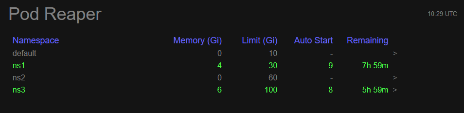

# pod-reaper

Provide namespace scheduling and manual startup



This component was created to help manage a Kubernetes
cluster shared by different teams. Assumptions are:

- each team has one or more namespaces where their pods run
- don't want to pay for 24/7 operation
- for most namespaces there's a core CI window of 8h each weekday
- occasionally teams would like to use their environments after hours

This solution is a k8s pod which runs in the background:

- it "stops" namespaces by setting a zero limit and deleting pods
- it "starts" namespaces by removing the zero limit
- namespaces are stopped 8h after the last scheduled or manual start

The UI served by the k8s pod allows the following:

- click ">" to manually start a namespace or extend for another 8 hours
- set optional weekday start time for namespace
- set memory limit for namespace (min 10G, max 100G)

## Running

To build and run the docker container, use `make run` then go to
[http://localhost:8080](http://localhost:8080) for the UI.

## Deployment

```bash
# namespace needs to be created before applying
kubectl create ns podreaper

# deploys pod as well as service account, cluster role
# and cluster role binding which allow it to make changes to the
# other namespaces
kubectl apply -f deploy.yaml -n podreaper

# to access the ui on http://localhost:8080
kubectl port-forward deployment/podreaper 8080:8080 -n podreaper
```

## Development

Note: There are two backend implementations, fake and kubernetes. Choose the
one you would like to use in `src/main/resources/application.yml` before
running the back end e.g. set `backend.fake.enabled` to `true`. In order to use the
kubernetes backend you must have a working cluster and kubeconfig defined.

1. Run the back end using `make backend-dev`
2. Run the front end using `make frontend-dev`
3. Go to [http://localhost:3000](http://localhost:3000) in your browser to
   test. The UI will automatically reload when front end code is changed.

For front end unit tests run `make frontend-test`.

- Front end is written in [Elm](https://elm-lang.org/)
- Using [Create Elm App](https://github.com/halfzebra/create-elm-app)
- Icon generated with [https://favicon.io/favicon-generator/](https://favicon.io/favicon-generator/)
- Back end using [Micronaut](https://micronaut.io/) and [Kotlin](https://kotlinlang.org/)
- Using the [fabric8 kubernetes client](https://github.com/fabric8io/kubernetes-client)
  to access the Kubernetes API.
